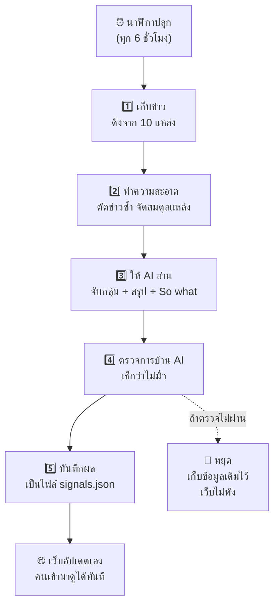

# Signal Radar ทำงานอย่างไร — ฉบับอ่านแล้วเข้าใจ

เอกสารนี้อธิบายว่าระบบนี้คืออะไรและทำงานยังไง **โดยไม่ต้องมีพื้นฐานเขียนโปรแกรม**
ถ้าอ่านจบแล้วยังงงตรงไหน แปลว่าเอกสารนี้เขียนไม่ดีพอ ไม่ใช่คุณอ่านไม่เข้าใจ

> 📄 อยากดูฉบับสรุปสั้นสำหรับนักพัฒนา → อ่าน [README.md](./README.md)

---

## 1. สรุปใน 30 วินาที

**Signal Radar คือ "ผู้ช่วยอ่านข่าวเศรษฐกิจ" ที่ทำงานเองทุก 6 ชั่วโมง ตลอด 24 ชั่วโมง โดยไม่มีใครสั่ง**

ลองนึกภาพว่าคุณจ้างเด็กฝึกงานคนหนึ่ง แล้วสั่งงานว่า:

> "ทุก 6 ชั่วโมง ให้ไปอ่านข่าวธุรกิจไทยจาก 10 สำนัก
> แล้วสรุปมาให้ฉันว่า **มีอะไรเปลี่ยนไปบ้างที่ฉันควรรู้**
> ไม่ต้องเล่าข่าวทีละชิ้น แต่ให้จับกลุ่มข่าวที่เรื่องเดียวกันมารวมกัน
> แล้วบอกด้วยว่า **แล้วยังไงต่อ (So what?)** ธุรกิจควรทำอะไร"

Signal Radar คือเด็กฝึกงานคนนั้น แต่เป็นซอฟต์แวร์ — ไม่ลาป่วย ไม่ลืม และทำงานฟรี

**ผลลัพธ์** คือหน้าเว็บที่แสดง "สัญญาณ" (signal) 10-15 อัน แต่ละอันบอกว่า:
- เกิดอะไรขึ้น
- **แล้วยังไงต่อ** ← หัวใจของระบบ
- สำคัญแค่ไหน (1-5) และมั่นใจแค่ไหน (%)
- อ้างอิงข่าวจริงกี่ชิ้น (กดดูได้)

---

## 2. ปัญหาที่ระบบนี้แก้

ทีมกลยุทธ์ของบริษัทต้องรู้ว่าตลาดกำลังเปลี่ยนไปทางไหน วิธีเดิมคือ **ให้คนนั่งไล่อ่านข่าวเองทุกวัน** ซึ่งมีปัญหา 3 อย่าง:

| ปัญหา | ทำไมถึงแย่ |
|---|---|
| 🕐 **กินเวลา** | อ่านข่าว 70 ชิ้นใช้เวลาเป็นชั่วโมง ทุกวัน |
| 🔁 **ซ้ำซาก** | เป็นงานเดิมๆ ที่ทำทุกวัน เหมาะกับให้เครื่องทำ |
| 😮‍💨 **ทำได้ไม่สม่ำเสมอ** | พองานยุ่งก็หยุดอ่าน แล้วก็พลาดข่าวสำคัญ |

> งานที่ **ทำซ้ำๆ + ใช้เวลามาก + คนมักลืมทำ** = งานที่ควรเปลี่ยนเป็นระบบอัตโนมัติ
> นี่คือเหตุผลที่โปรเจกต์นี้เกิดขึ้น

---

## 3. ภาพรวมของระบบ



ทั้งหมดนี้ **ไม่มีคนกดอะไรเลย** เกิดขึ้นเองบนเซิร์ฟเวอร์ของ GitHub

---

## 4. เดินทีละขั้น — เกิดอะไรขึ้นบ้าง

### ⏰ ขั้น 0: นาฬิกาปลุก

มีตัวตั้งเวลาชื่อ **GitHub Actions** ทำหน้าที่เหมือนนาฬิกาปลุกบนคลาวด์
ตั้งไว้ว่า *"ทุก 6 ชั่วโมง ให้ปลุกโปรแกรมขึ้นมาทำงาน 1 รอบ"*

เทียบง่ายๆ: เหมือนตั้งเตือนในมือถือให้รดน้ำต้นไม้ ต่างกันแค่ว่าอันนี้พอเตือนแล้ว **มันรดน้ำให้เองด้วย**

---

### 1️⃣ ขั้นที่ 1: ไปเก็บข่าว

**RSS คืออะไร?**
เว็บข่าวส่วนใหญ่มี "ช่องทางลับ" ที่ปล่อยรายการข่าวล่าสุดออกมาในรูปแบบที่เครื่องอ่านง่าย เรียกว่า **RSS**

> เปรียบเทียบ: เว็บข่าวปกติ = ร้านอาหารที่ต้องเดินเข้าไปนั่งอ่านเมนู
> RSS = บริการส่งเมนูมาให้ถึงบ้านเป็นรายการสั้นๆ

ระบบดึงจาก **10 แหล่ง** ครอบคลุม 6 หมวด:

| หมวด | ตัวอย่างที่ตามอยู่ |
|---|---|
| 💰 Economic | เศรษฐกิจไทย, การลงทุน |
| 🏢 Business | เศรษฐกิจดิจิทัล, สตาร์ทอัพระดมทุน |
| 🏭 Industry | อีคอมเมิร์ซ |
| 🛒 Consumer | พฤติกรรมผู้บริโภค |
| 💻 Technology | AI ในธุรกิจ, Blognone |
| 📊 อื่นๆ | Techsauce |

ได้มาประมาณ **70 ข่าว** ต่อรอบ

**ข้อดี:** RSS ใช้ฟรี ไม่ต้องขอรหัสอะไรทั้งนั้น

---

### 2️⃣ ขั้นที่ 2: ทำความสะอาดข้อมูล

ข่าวดิบใช้ไม่ได้ทันที ต้องจัดการ 3 อย่าง:

**ก) ลบโค้ดขยะออก**
ข่าวที่ดึงมามีโค้ดเว็บปนอยู่ (พวก `<p>`, `&amp;`) ต้องล้างให้เหลือแต่ข้อความอ่านได้

**ข) ตัดข่าวซ้ำ**
ข่าวเรื่องเดียวกันมักถูกลงหลายสำนัก ระบบจะเทียบชื่อข่าว (หลังตัดชื่อสำนักข่าวออก) แล้วเก็บไว้อันเดียว

**ค) จัดสมดุลแหล่งข่าว** ← จุดที่คนมักมองข้าม
ถ้าปล่อยตามธรรมชาติ สำนักข่าวที่ลงข่าวถี่ที่สุดจะกินพื้นที่หมด ระบบจึงหยิบข่าวแบบ **"วนทีละแหล่ง"**

> เหมือนแบ่งขนมให้เด็ก 10 คน — ต้องแจกวนทีละคน ไม่ใช่ให้คนแรกหยิบจนพอใจแล้วค่อยไปคนถัดไป

---

### 3️⃣ ขั้นที่ 3: ให้ AI อ่านและวิเคราะห์

ขั้นนี้คือหัวใจ ระบบส่งข่าวทั้ง 70 ชิ้นให้ **Gemini** (AI ของ Google) พร้อมคำสั่งประมาณว่า:

> *"คุณคือนักวิเคราะห์กลยุทธ์ที่ดูตลาดไทย*
> *นี่คือข่าว 70 ชิ้น ให้จับกลุ่มข่าวที่เป็นเรื่องเดียวกันเข้าด้วยกัน*
> *แล้วสรุปออกมาเป็น 'สัญญาณ' ไม่เกิน 14 อัน*
> *แต่ละอันต้องบอกด้วยว่า **ทีมกลยุทธ์ควรสนใจเพราะอะไร** และห้ามพูดซ้ำกับสรุป"*

**ทำไมต้อง "จับกลุ่ม" ไม่ใช่สรุปทีละข่าว?**

เพราะข่าว 1 ชิ้น = เหตุการณ์ แต่ข่าว 8 ชิ้นที่พูดเรื่องคล้ายกัน = **แนวโน้ม**
สิ่งที่ทีมกลยุทธ์ต้องการคือแนวโน้ม ไม่ใช่เหตุการณ์

ตัวอย่างผลจริงที่ระบบสรุปได้:

> **"Enterprise AI Adoption Escalates While SMEs Face Legacy IT Bottlenecks"**
> *(องค์กรใหญ่เร่งใช้ AI แต่ SME ติดปัญหาระบบไอทีเก่า)*
> — รวมมาจากข่าว **8 ชิ้น**
>
> 💡 **So what:** ผู้ขายเทคโนโลยี B2B ควรเลิกขาย "ซอฟต์แวร์ AI เดี่ยวๆ"
> แล้วหันไปขาย "บริการเชื่อมระบบแบบครบวงจร" สำหรับลูกค้าขนาดกลางแทน

สังเกตว่า So what **ไม่ได้เล่าข่าวซ้ำ** แต่บอกว่า *แล้วธุรกิจควรทำอะไร* — นั่นคือคุณค่าจริงของระบบ

---

### 4️⃣ ขั้นที่ 4: ตรวจการบ้าน AI ← ขั้นที่สำคัญที่สุด

**ปัญหาใหญ่ของ AI คือมัน "มั่ว" ได้** (ศัพท์ทางการเรียก *hallucination*)
เช่น อ้างลิงก์ข่าวที่ไม่มีอยู่จริง ซึ่งอันตรายมากถ้าเอาไปใช้ตัดสินใจ

**วิธีแก้ของระบบนี้: ไม่ให้ AI เขียนลิงก์เลยแม้แต่ตัวเดียว**

ขั้นตอนเป็นแบบนี้:

1. ตอนส่งข่าวให้ AI เราติด **หมายเลขกำกับ** ไว้ทุกชิ้น → `ข่าว 0`, `ข่าว 1`, ... `ข่าว 69`
2. สั่ง AI ว่า *"ถ้าจะอ้างอิงข่าว ให้บอกมาแค่ **หมายเลข** พอ"*
3. พอ AI ตอบกลับมาว่า `[3, 17, 42]` เราค่อยเอาหมายเลขไป **เปิดตารางข่าวจริงของเราเอง** แล้วดึงลิงก์จริงมาใส่

> **เปรียบเทียบ:** เหมือนให้นักเรียนอ้างอิงหนังสือ แต่แทนที่จะให้เขียนชื่อหนังสือเอง (ซึ่งอาจจำผิด/แต่งขึ้น)
> เราให้เขาบอกแค่ **เลขชั้นวาง** แล้วครูเดินไปหยิบหนังสือจากชั้นนั้นเอง
> → **ต่อให้อยากมั่ว ก็มั่วไม่ได้** เพราะถ้าบอกเลขที่ไม่มีอยู่ ครูก็หยิบไม่เจอ แล้วทิ้งข้อนั้นไป

นอกจากนี้ยังตรวจอีก 4 อย่าง:

| ตรวจอะไร | ถ้าไม่ผ่านทำอย่างไร |
|---|---|
| อ้างอิงข่าวจริงอย่างน้อย 1 ชิ้น | **ทิ้งสัญญาณนั้น** |
| มี "So what" ไม่ว่าง | **ทิ้งสัญญาณนั้น** |
| คะแนนความสำคัญอยู่ในช่วง 1-5 | บีบให้อยู่ในช่วง |
| หมวดหมู่ต้องเป็นหมวดที่เรากำหนด | เปลี่ยนเป็นค่าเริ่มต้น |

---

### 5️⃣ ขั้นที่ 5: บันทึกผลและอัปเดตเว็บ

เมื่อผ่านการตรวจแล้ว ระบบเขียนผลลงไฟล์ชื่อ **`signals.json`**

> **JSON คืออะไร?** คือรูปแบบไฟล์ข้อความที่จัดระเบียบให้เครื่องอ่านง่าย
> คิดว่าเป็น "ตาราง Excel ฉบับข้อความ" ก็ได้

จากนั้นเกิด 2 อย่างอัตโนมัติ:
1. ระบบ **บันทึกไฟล์กลับเข้า GitHub** (เหมือนกด Save งานเข้าคลัง)
2. **Vercel** (ผู้ให้บริการเว็บ) เห็นว่าไฟล์เปลี่ยน → **สร้างเว็บใหม่ให้เองภายในไม่กี่วินาที**

ผลคือ: คนเข้าเว็บมาก็เห็นข้อมูลใหม่ทันที โดยไม่มีใครต้องกดอะไร

---

## 5. หน้าเว็บทำงานอย่างไร

หน้าเว็บ **ไม่ได้คุยกับ AI เลย** มันแค่เปิดไฟล์ `signals.json` ขึ้นมาแสดง — เหมือนเปิดไฟล์ Excel อ่าน

สิ่งที่ทำได้บนหน้าเว็บ:

- **📊 การ์ดสัญญาณ** — เรียงตามความสำคัญ × ความมั่นใจ
- **🔍 กรอง** — เลือกหมวด, ความสำคัญขั้นต่ำ, ช่วงเวลา, ค้นหาข้อความ
- **📈 กราฟ** — ดูว่าสัญญาณกระจุกอยู่หมวดไหน
- **📎 กดดูแหล่งข่าว** — เปิดอ่านข่าวต้นทางจริงได้
- **👍👎 ให้คะแนนความเกี่ยวข้อง** — ระบบจะจัดอันดับใหม่ให้ตรงกับความสนใจของคุณ

**เรื่อง 👍👎 ทำงานยังไง?**
คะแนนที่คุณกดถูกเก็บไว้ **ในเบราว์เซอร์ของคุณเองเท่านั้น** (เรียกว่า `localStorage`)
- ✅ ไม่ถูกส่งไปไหน ไม่มีใครเห็น
- ✅ ปิดเว็บแล้วเปิดใหม่ก็ยังจำได้
- ⚠️ แต่ถ้าเปลี่ยนเครื่อง/เบราว์เซอร์ จะเริ่มใหม่

---

## 6. คำถามที่คนมักสงสัย

<details>
<summary><b>❓ ทำไมไม่ให้หน้าเว็บเรียก AI ตรงๆ ไปเลย จะได้ข้อมูลสดตลอด?</b></summary>

<br>

เพราะ **รหัสลับจะรั่ว**

การเรียก AI ต้องใช้ "กุญแจ" (API key) ซึ่งเป็นความลับ
แต่โค้ดของหน้าเว็บ **ใครก็เปิดดูได้** (กด F12 ในเบราว์เซอร์ก็เห็นแล้ว)

ถ้าเอากุญแจไปไว้ในหน้าเว็บ = เอากุญแจบ้านไปแขวนไว้หน้าประตู
คนอื่นจะเอาไปใช้ยิง AI จนโควตาเราหมด หรือทำให้เราโดนเรียกเก็บเงิน

**ทางแก้:** ให้ AI ทำงานบนเซิร์ฟเวอร์ของ GitHub ตอนตี 1 (ที่ไม่มีใครเห็นกุญแจ)
แล้วหน้าเว็บอ่านแค่ **ผลลัพธ์** ที่เตรียมไว้แล้ว → ปลอดภัย + เร็ว + ฟรี

</details>

<details>
<summary><b>❓ ถ้า AI ล่มหรือตอบมั่ว จะเกิดอะไรขึ้น?</b></summary>

<br>

ระบบออกแบบมาแบบ **"ล้มแบบปลอดภัย" (fail closed)** — ถ้าเกิดปัญหา จะ**ไม่ยอมเขียนทับข้อมูลเดิม**

เหตุการณ์จริงที่เคยเกิด: รอบแรกที่ระบบรันอัตโนมัติ Gemini ตอบกลับมาว่า
`503 Service Unavailable` (เซิร์ฟเวอร์ Google โหลดเต็ม)

ระบบทำแบบนี้:
1. หยุดทันที ไม่เขียนไฟล์
2. เว็บยังแสดงข้อมูลรอบก่อนหน้าตามปกติ → **ผู้ใช้ไม่รู้สึกอะไรเลย**
3. รอบถัดไป (อีก 6 ชม.) ค่อยลองใหม่

หลังจากนั้นเราเพิ่ม **ระบบลองใหม่อัตโนมัติ**:
- เจอปัญหาชั่วคราว (เซิร์ฟเวอร์ล่ม/คนใช้เยอะ) → รอ 5 วิ → 15 วิ → 45 วิ แล้วลองใหม่
- เจอปัญหาถาวร (กุญแจผิด) → เลิกทันที ไม่เสียเวลา

</details>

<details>
<summary><b>❓ เสียเงินไหม?</b></summary>

<br>

**ไม่เสียเลยสักบาท** เพราะทุกส่วนใช้แพ็กเกจฟรี:

| ส่วน | ทำไมถึงฟรี |
|---|---|
| GitHub Actions (ตัวตั้งเวลา) | โปรเจกต์แบบเปิดสาธารณะใช้ได้ไม่จำกัด |
| Gemini AI | มีโควตาฟรี และ **ไม่ได้ผูกบัตรเครดิต** |
| Vercel (โฮสต์เว็บ) | แพ็กเกจ Hobby ฟรี |
| RSS (ข่าว) | เปิดให้ใช้สาธารณะ |

รันวันละ 4 ครั้ง = ~120 ครั้ง/เดือน ซึ่งน้อยมากเทียบกับโควตาฟรี
และเพราะไม่ได้ผูกบัตร ต่อให้ใช้เกินก็แค่ถูกปฏิเสธ **ไม่มีทางถูกตัดเงิน**

</details>

<details>
<summary><b>❓ ข้อมูลสดแค่ไหน?</b></summary>

<br>

อัปเดตทุก **6 ชั่วโมง** (วันละ 4 รอบ) และข่าวที่ดึงเป็นข่าวย้อนหลังไม่เกิน 7 วัน

บนหน้าเว็บมีบอกไว้ตลอดว่า *"Updated 2h ago"* จะได้รู้ว่าข้อมูลเก่าแค่ไหน

</details>

<details>
<summary><b>❓ ทำไมต้องมีคะแนน "ความมั่นใจ" ด้วย?</b></summary>

<br>

เพราะสัญญาณที่มาจากข่าว **8 สำนัก** น่าเชื่อกว่าสัญญาณที่มาจากข่าว **1 สำนัก**

AI จะให้คะแนนความมั่นใจตามจำนวนแหล่งที่ยืนยันตรงกัน
คุณจึงเห็นได้ทันทีว่าอันไหน "ค่อนข้างแน่" และอันไหน "ยังต้องดูต่อ"

⚠️ หมายเหตุตามตรง: คะแนนนี้เป็นการ**ประเมินของ AI เอง** ไม่ใช่ค่าทางสถิติ

</details>

---

## 7. ศัพท์ที่เจอในเอกสารนี้

| คำ | แปลง่ายๆ |
|---|---|
| **RSS** | ช่องทางที่เว็บข่าวปล่อยรายการข่าวล่าสุดให้เครื่องอ่าน |
| **API key** | กุญแจ/รหัสผ่านสำหรับเรียกใช้บริการของคนอื่น (ต้องเก็บเป็นความลับ) |
| **LLM** | AI ที่เข้าใจและเขียนภาษาคนได้ (เช่น Gemini, ChatGPT) |
| **JSON** | รูปแบบไฟล์ข้อความที่จัดระเบียบให้เครื่องอ่านง่าย |
| **GitHub Actions** | นาฬิกาปลุก + คนงานบนคลาวด์ ที่รันงานให้อัตโนมัติ |
| **Cron** | วิธีเขียนตารางเวลาว่า "ให้ทำงานตอนไหนบ้าง" |
| **Static site** | เว็บที่เป็นไฟล์สำเร็จรูป ไม่มีเซิร์ฟเวอร์คิดงานตอนคนเข้า → เร็วและถูก |
| **localStorage** | พื้นที่เก็บข้อมูลเล็กๆ ในเบราว์เซอร์ของผู้ใช้แต่ละคน |
| **Hallucination** | อาการที่ AI "มั่ว" ข้อมูลที่ไม่มีอยู่จริงออกมาอย่างมั่นใจ |
| **Fail closed** | ออกแบบให้เวลาพัง ระบบหยุดอย่างปลอดภัย แทนที่จะพังไปทั้งระบบ |

---

## 8. ข้อจำกัดที่ควรรู้ (พูดตามตรง)

ระบบนี้ไม่ได้สมบูรณ์แบบ นี่คือข้อจำกัดจริง:

1. **อ่านได้แค่หัวข้อกับย่อหน้าแรก** — RSS ไม่ได้ให้เนื้อข่าวเต็ม การวิเคราะห์จึงลึกได้ระดับหนึ่ง
2. **ดีได้เท่าที่แหล่งข่าวดี** — ถ้าแหล่งข่าวมีอคติ ผลลัพธ์ก็จะเอียงตาม
3. **คะแนนความมั่นใจเป็นการประเมินของ AI** ไม่ใช่ค่าทางสถิติที่พิสูจน์ได้
4. **บางครั้งมีข่าวคุณภาพต่ำหลุดเข้ามา** (เช่นโพสต์จากโซเชียล) ยังต้องกรองแหล่งเพิ่ม
5. **ยังไม่มีการเทียบย้อนหลัง** — ระบบยังไม่ได้บอกว่าสัญญาณเดือนที่แล้วแม่นหรือไม่

---

## 9. ถ้าอยากลองรันเอง

```bash
npm install     # ติดตั้งส่วนประกอบ
npm run dev     # เปิดหน้าเว็บด้วยข้อมูลตัวอย่าง
```

อยากให้ AI วิเคราะห์จริง ต้องมีกุญแจฟรีจาก [Google AI Studio](https://aistudio.google.com/apikey):

```bash
cp .env.example .env    # แล้วใส่ GEMINI_API_KEY ลงไป
npm run pipeline        # สั่งให้ระบบทำงาน 1 รอบ
```

> ⚠️ ใส่กุญแจใน `.env` เท่านั้น **ห้ามใส่ใน `.env.example`** เพราะไฟล์นั้นถูกอัปขึ้น GitHub

---

<div align="center">

**พัฒนาโดย Natthaphon Phukaew**
[กลับไปหน้า README](./README.md)

</div>
